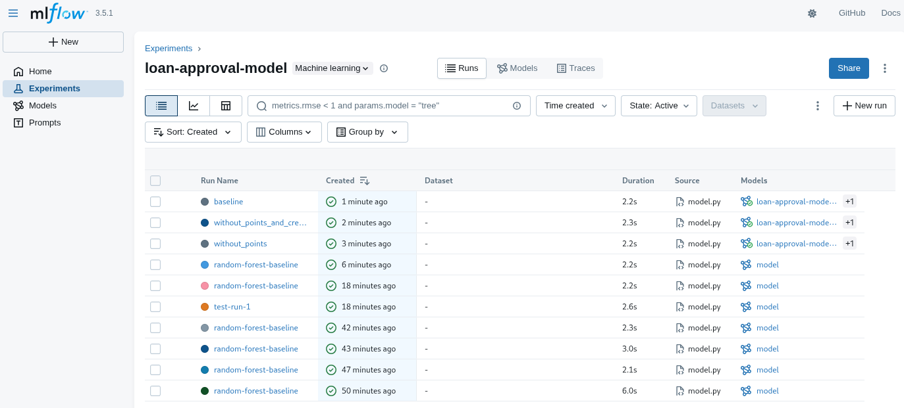
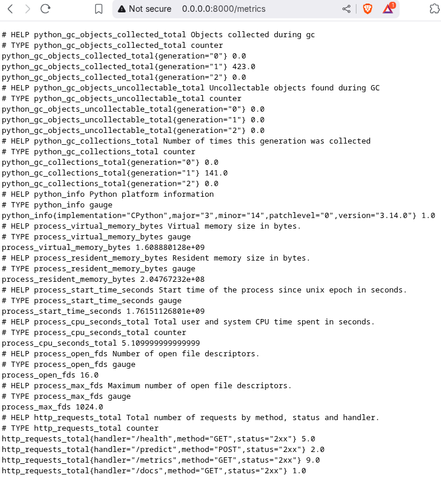
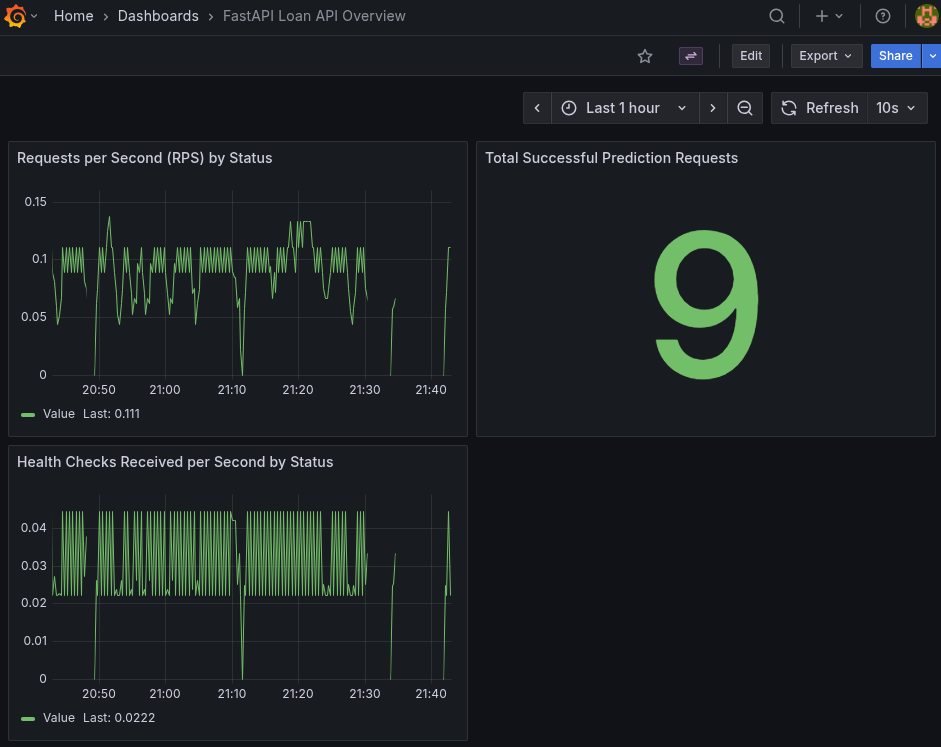

# ML Service

- A minimal showcase to integrate a Machine Learning
  REST API service into a legacy IT system.
- The tools & techniques used here help you understand the
  skill set of a data scientist in a corporate AI lab.

## Material covered

- Based on a data excerpt, we explore the data & develop a Machine Learning algorithm.
- We wrap the algorithm in a FastAPI wrapper and expose a REST API.
- Next, the API will be consumed by the existing IT system.
- Lastly, we'll add Github Actions and add a monitoring suite.

### Task

You work for a bank and are requested to develop an algorithm that approves
or rejects loans. The bank uses an old legacy IT system, which means that
you won't be able to deploy the algorithm within the IT system. Instead,
you need to develop the algorithm outside the existing IT system
and then integrate it.

[This is the dataset](https://www.kaggle.com/datasets/anishdevedward/loan-approval-dataset)
to develop the loan application algorithm.

### Course plan

| Phase | Tasks & Components |
| :--- | :--- |
| **Plan** | - well-reasoned product specification  - transparent repo structure |
| **Developing the model** | - environment mgmt. with pixi - EDA with Jupyter Notebook - model tracking with MLFlow |
| **Serving the model** | - web service & REST endpoint with FastAPI - data validation with pydantic - containerisation with docker - creating a network between containers - automated tests with pytest & GitHub Actions |
| **Integrating the model** | - legacy IT system calls API - monitoring with Prometheus & Grafana |

### Development flow

### Screenshots

### Helpful task commands

See the `tasks` sections in the `pixi.toml` file for helpful task commands.
