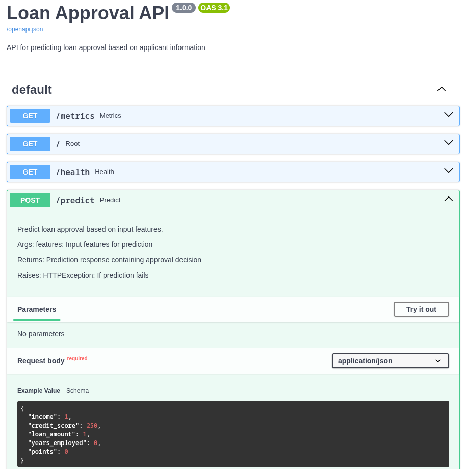

# ML Service

- A minimal showcase to integrate a Machine Learning
  REST API service into a legacy IT system.
- The tools & techniques used here help you understand the
  skill set of a data scientist in a corporate AI lab.

## Material covered

- Based on a data excerpt, we explore the data & develop a Machine Learning algorithm.
- We wrap the algorithm in a FastAPI wrapper and expose a REST API.
- Next, the API will be consumed by the existing IT system.
- Lastly, we'll add Github Actions and add a monitoring suite.

### Task

You work for a bank and are requested to develop an algorithm that approves
or rejects loans. The bank uses an old legacy IT system, which means that
you won't be able to deploy the algorithm within the IT system. Instead,
you need to develop the algorithm outside the existing IT system
and then integrate it.

[This is the dataset](https://www.kaggle.com/datasets/anishdevedward/loan-approval-dataset)
to develop the loan application algorithm.

### Course plan

| Phase | Tasks & Components |
| :--- | :--- |
| **Plan** | - well-reasoned product specification<br> - transparent repo structure |
| **Developing the model** | - managing the terminal<br>- source control with git<br>- environment mgmt. with pixi<br>- EDA with Jupyter Notebook<br>- model tracking with MLFlow |
| **Serving the model** | - web service & REST endpoint with FastAPI<br>- data validation with pydantic<br>- containerisation with docker |
| **Integrating the model** | - legacy IT system calls API<br>- monitoring with Grafana |

### Development flow


### Screenshots



### Helpful task commands

See the `tasks` sections in the `pixi.toml` file for helpful task commands.

## Monitoring with Prometheus and Grafana

The API is instrumented with Prometheus metrics and includes a pre-configured Grafana dashboard for visualization.

### Quick Start

```bash
docker-compose up
```

This will start:
- **Loan API**: http://localhost:8000
- **Prometheus**: http://localhost:9090
- **Grafana**: http://localhost:3000

### Accessing the Dashboard

1. **Grafana Dashboard**: Open http://localhost:3000
   - Default credentials: `admin` / `admin`
   - The "Loan API Metrics" dashboard is automatically provisioned
   - Shows real-time metrics for your API

2. **Prometheus UI**: Open http://localhost:9090
   - Query metrics directly
   - Explore available metrics
   - Create custom graphs

3. **API Metrics Endpoint**: http://localhost:8000/metrics
   - Raw Prometheus metrics in text format

### Dashboard Panels

The pre-configured Grafana dashboard includes:

- **Request Rate** - Requests per second over time
- **Average Request Duration** - Response time trends
- **Error Rate** - Exceptions per second
- **Requests In Progress** - Current active requests
- **Total Requests by Endpoint** - Traffic distribution across endpoints
- **Requests by Status Code** - HTTP status code breakdown

### Available Metrics

The API automatically exposes these Prometheus metrics:

- `fastapi_requests_total` - Total number of requests
- `fastapi_requests_duration_seconds` - Request duration histogram
- `fastapi_requests_in_progress` - Currently processing requests
- `fastapi_requests_exceptions_total` - Total exceptions

### Example Prometheus Queries

```promql
# Request rate (requests per second)
rate(fastapi_requests_total[1m])

# Average request duration
rate(fastapi_requests_duration_seconds_sum[1m]) / rate(fastapi_requests_duration_seconds_count[1m])

# Error rate
rate(fastapi_requests_exceptions_total[1m])

# Requests to /predict endpoint
rate(fastapi_requests_total{endpoint="/predict"}[1m])

# 95th percentile latency
histogram_quantile(0.95, rate(fastapi_requests_duration_seconds_bucket[5m]))

# Success rate
rate(fastapi_requests_total{status_code=~"2.."}[1m]) / rate(fastapi_requests_total[1m])
```

### Customizing the Dashboard

To modify the dashboard:

1. Edit the dashboard in Grafana UI
2. Export the dashboard JSON
3. Replace the content in `grafana/provisioning/dashboards/loan-api-dashboard.json`
4. Restart the containers: `docker-compose restart grafana`

### Adding Alerts

To add alerting rules, create a `prometheus-rules.yml` file and mount it in the Prometheus container. Example:

```yaml
groups:
  - name: loan_api
    rules:
      - alert: HighErrorRate
        expr: rate(fastapi_requests_exceptions_total[5m]) > 0.05
        for: 5m
        annotations:
          summary: "High error rate detected"
```
